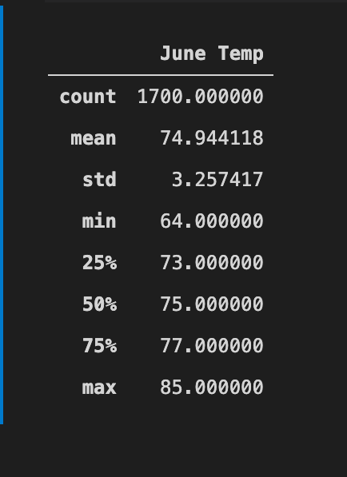
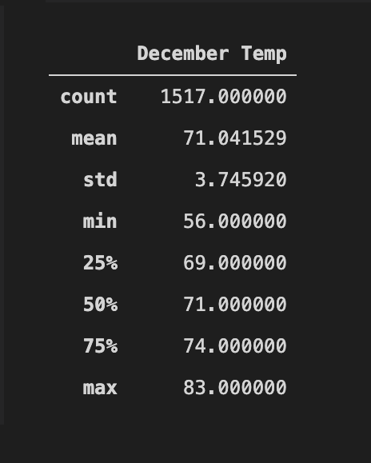
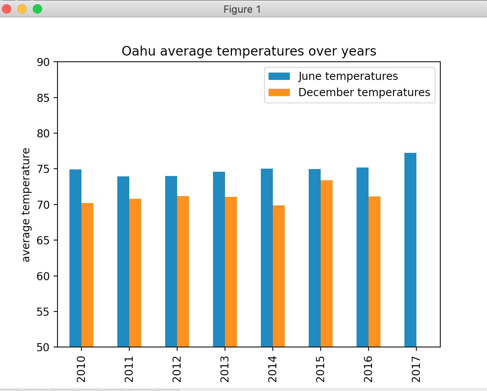

# surfs_up
Overview of the analysis

W. Avy wants more information about temperature trends before opening the surf shop.
Specifically, he wants temperature data for the months of June and December in Oahu, 
in order to determine if the surf and ice cream shop business is sustainable year-round.

Results:
According to the descriptive stats on each month, there are 3 differences between June and December:
- The mean of temperature in June is higher than December which is exceptable.
- The minimum of temperature in June is also higher than December.
- STD in December is higher than June as temperatures in June are closer to the mean.

     

Summary:
There is a little difference between June and December temperatures also the average precipations 
dont change alot during June and December.
 
     
In conclusion Oahu is a suitable location for the bussiness of surfing and ice cream  year-around.